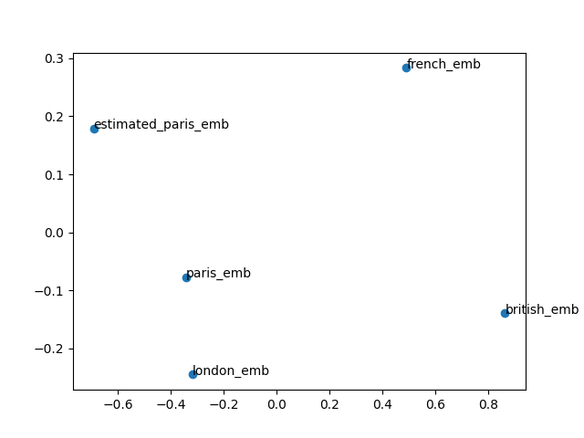
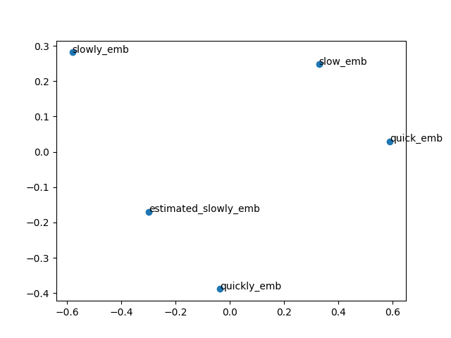

# Skip-gram Word2vec implementation for JetBrains internship application

A week-long project for 2026 JetBrains internship application.
The aim was to implement word2vec without using *any* ML framework,
but to code it up from scratch using NumPy instead.

## What is it?
### word2vec
word2vec intends to capture a semantic meaning of words by embedding them in a learnt
(embedding) vector space, using for that purpose the notion of *similarity* between the words in the context.
### Continuous Skip-gram Model
It tries to maximize classification of a word based on another word in the same sentence.
    We use each current word as an input to a log-linear classifier with continuous
    projection layer, and predict words within a certain range before and after the current word
### Negative sampling
To avoid computing softmax over the entire vocabulary, we perform negative sampling.
    Namely, we consider the true word-context pair to be a "positive sample", and then
    choose to sample k random words that we will treat as "negative samples".
    

It is a surrogate objective: instead of maximizing the exact conditional probability of the context word
    under a normalized model,
    it learns embeddings that are good at discriminating true word-context co-occurrences from noise

#### Distribution
We use unigram raised to the power of 3/4 as a distribution for the negative sampling

### Subsampling
We use subsampling to limit the consideration of the most frequent words, as they
    provide less information than rare words (think "the" vs. "Warsaw", the pair ("Warsaw", "Poland") is
    more semantically informative than the pair ("Warsaw", "the").

The new sampling probability becomes:

            P(w_i) = sqrt(t/frequency(w_i)),
            where t is an empirically chosen hyperparameter threshold, typically around 1e-5

### Loss
Our goal is to maximize 

        log(sigm(u_o^T * v_c) + sum_i=1_k log(sigm(-u_n_i^T * v_c))
        
Therefore, the loss function is: L = - objective

Let us introduce s^+ := u_o^T * v_c, s_i^- := u_n_i^T * v_c
        
Since:

            -log(sigm(x)) = log(1+e^(-x))
            -log(sigm(-x)) = log(1+e^x)
We obtain:

            L = log(1+e^(-s^+)) + sum_i=1_k log(1+e^(s_i^-))
### Gradient
Since:

            d/dx (-log(sigm(x))) = sigm(x) - 1
            d/dx (-log(sigm(-x))) = sigm(x)
We obtain:

            dL/ds^+ = sigm(s^+) - 1
            dL/ds^- = sigm(-s_i^-)
Therefore, knowing that ds/dv_c = u:

            dL/dv_i = (sigm(s^+) - 1) * u_o + sum_i=1_k sigm(s_i^-) * u_n_i
            dL/du_o = (sigm(s^+) - 1) * v_c
            dL/du_n_i = sigm(s_i^-) * v_c
Thus, we obtain our gradient.

The update rule is:

            v_c <- v_c - lr * dL/dv_c
            u_o <- u_o - lr * dL/du_o
            u_n_i <- u_n_i - lr * dL/du_n_i

## Training
### Dataset
I trained the model on the WikiText-2 dataset, which contains over 36718 tokens extracted from the set of verified Good and Featured articles on Wikipedia
https://huggingface.co/datasets/mindchain/wikitext2
https://www.kaggle.com/datasets/vivekmettu/wikitext2-data/code
### Parameters
```python
        model = Word2Vec(
            vocab_size=len(word_to_id),
            embedding_dim=100,
            lr=0.01,
            negative_samples=10,
            seed=42
        )

        model.train(
            corpus_ids=corpus_ids,
            word_to_id=word_to_id,
            counts=counts,
            window_size=3,
            epochs=10,
        )
```

## Results
### Vector arithmetics
One of the most significant findings of research on word embedding
is the discovery that if b is semantically analogous to a as d is to c, then:
    
    v(b) - v(a) + v(c) ~= v(d)
I have tried to discover similar patterns in my model. To that end, I analysed
the most frequent words in the dataset, and tried to pick a few sensible groups of them.
I then ran a PCA to illustrate the embeddings in 2D.

#### ("british", "french", "london", "paris")

#### ("quick", "slow", "quickly", "slowly")


The estimation is far from being perfect, but one can notice that if we rescaled (v(b) - v(a))
by suitable factors, we would get a good approximation, that is - adding the vector (v(b) - v(a)) brings us in an
approximately correct direction towards the actual embedding.

It must be noted, however, that a lot of sensible groupings did *not* display this expected property.
I suspect it is due to an insufficient training time caused by time and computation power constraints.

These words correspond to the vectors that are closest to the vector e = v("british") - v("french") + v("london") (together with their cosine similarity):

```
[('member', np.float64(0.9645285295689171)), ('paul', np.float64(0.958788255342849)), ('olivier', np.float64(0.9579262030592984)), ('born', np.float64(0.9564370975165644)), ('james', np.float64(0.9553641162310124)), ('child', np.float64(0.9541385524520576)), ('brother', np.float64(0.9540847964091972)), ('daughter', np.float64(0.9532590992153174)), ('invited', np.float64(0.9520873857654435)), ('dean', np.float64(0.9516551175066748)), ('youth', np.float64(0.9513691239520556)), ('thomas', np.float64(0.9495841971439283)), ('chapter', np.float64(0.9491237136401125)), ('theatre', np.float64(0.9487713733382774)), ('married', np.float64(0.9468181845278075)), ('peter', np.float64(0.9464535825518804)), ('max', np.float64(0.9455626434210271)), ('howard', np.float64(0.9454057805865947)), ('paris', np.float64(0.9446202101382475)), ('gary', np.float64(0.9434545082417729))]
```

We can see Paris among them. We can also see several British names. As to why they are so close to e, it remains a mystery to me.

### Most similar words

The following are the words most similar, according to the model, to the word 'catholic':

```aiignore
[('assembly', np.float64(0.9822086332696157)), ('roman', np.float64(0.9819992409335265)), ('protestant', np.float64(0.9808148478777787)), ('religious', np.float64(0.9798643317345838)), ('churches', np.float64(0.9781787385418081)), ('authority', np.float64(0.9781637690990991)), ('historians', np.float64(0.9777708311482916)), ('kings', np.float64(0.9775008213028825)), ('holy', np.float64(0.9761199206950757)), ('monarch', np.float64(0.9759076836909736))]
```

We can see this results are sensible, all the words share some common context, we can see e.g. 'churches' or other faiths.

## Possible improvements
### Results
- Due to the time constraints, I was unable to provide a graph that would display loss across the training process
### Dataset
- With more computation power, I could have used a larger dataset, like wikitext-103 (with over 1M tokens)
### Algorithm performance
- Performance could have been enhanced had I conducted a proper hyperparameter search to find best possible hyperparameters
and figure out a sensible training time
- The limitation of word2vec is that it always uses words as tokens. Performance could have been enhanced if we allowed smaller letter groups to be tokens (https://aclanthology.org/Q17-1010.pdf)

## References
- T. Mikolov, K. Chen, G. Corrado, and J. Dean, “Efficient Estimation of Word Representations in Vector Space,” arXiv.org, Sep. 06, 2013. http://arxiv.org/abs/1301.3781
- Y. Goldberg and O. Levy, “word2vec Explained: deriving Mikolov et al.'s negative-sampling word-embedding method,” arXiv.org, Feb. 15, 2014. http://arxiv.org/abs/1402.3722
- T. Mikolov, I. Sutskever, K. Chen, G. S. Corrado, and J. Dean, “Distributed representations of words and phrases and their compositionality,” in Advances in Neural Information Processing Systems, C. J. Burges, L. Bottou, M. Welling, Z. Ghahramani, and K. Q. Weinberger, Eds., Curran Associates, Inc., 2013. Available: https://proceedings.neurips.cc/paper_files/paper/2013/file/9aa42b31882ec039965f3c4923ce901b-Paper.pdf